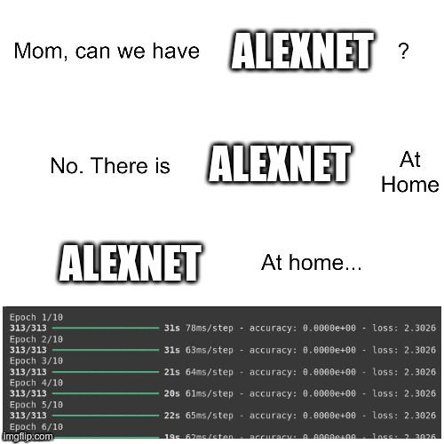

# "We Have AlexNet at Home"

We made [AlexNet](https://paperswithcode.com/method/alexnet) from scratch with Tensorflow, using the CIFAR10 dataset.

All of the code can be found in the Jupyter notebook `WeHaveAlexNetAtHome.ipynb`. The model's weights have been saved as `alexnet-at-home.keras`.
